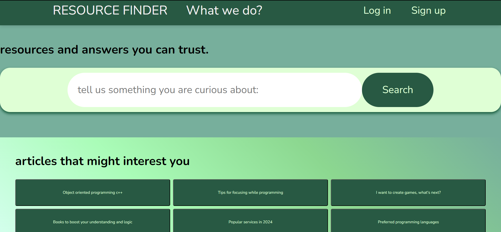
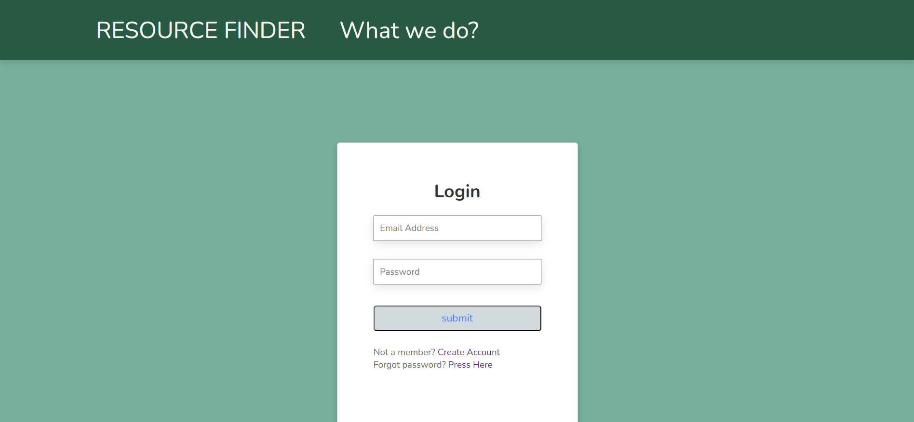
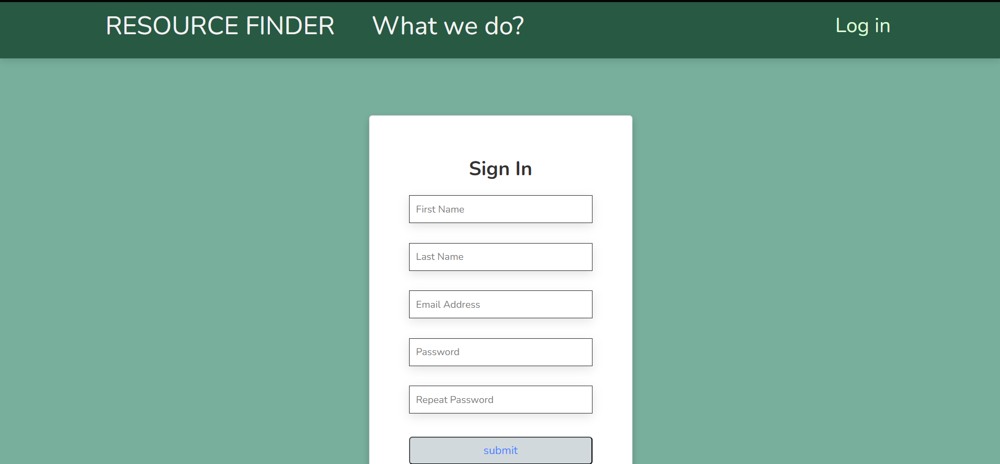
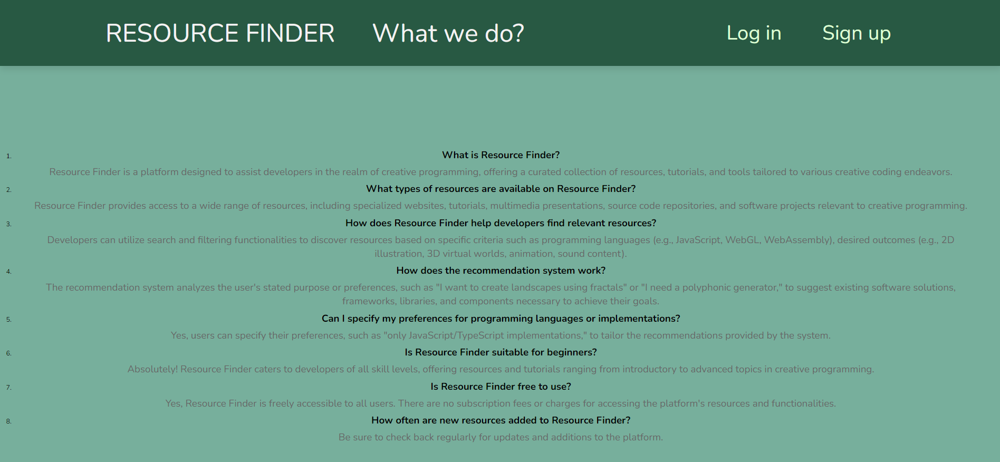
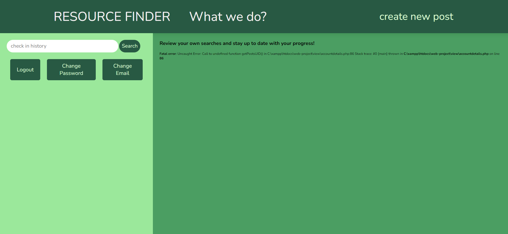
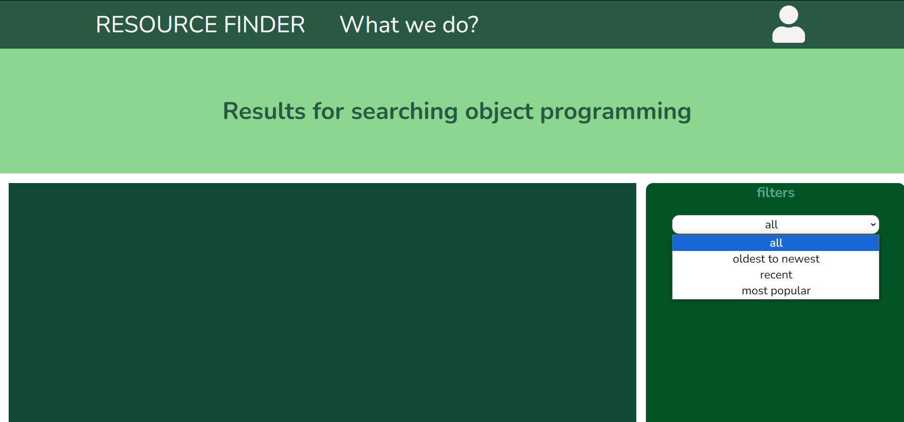

# Resource Finder

## Authors
- Burciu Daniel
  - Email: daniel.burciu99@gmail.com
- Stegaru Razvan
  - Email: razvan.stegaru@gmail.com

## 1. Introduction
The project "Resource Finder" is designed to be a comprehensive platform for developers engaged in creative coding, offering a wide array of resources, tutorials, and tools to support their endeavors.

### 1.4. Product Scope
The platform aims to facilitate the collection, interrelation, and discovery of resources relevant to creative programming, catering to various purposes alike programming languages, desired results, modes of interaction.

## 2. Overall Description
### 2.2 Product Functions
"Resource Finder" provides a centralized platform where people can access specialized websites, tutorials, multimedia presentations, source code tailored to their creative coding needs. Users can search, filter, and discover resources based on specific criteria such as programming language, desired outcome, and many others.

### 2.3 User Classes and Characteristics
- Guests: They can utilise the platform but this method is lacking the important "history menu".
- Regular users: They can make posts and have acces to their personal details and account, they can review old searches in the history. 
- Admin Users: They have additional privileges, including the ability to delete certain informations or users.

### 2.4 Operating Environment
"Resource Finder" is a web application that can be used on any device with an internet connection and a web browser.

### 2.7 Dependencies
The platform relies on various third-party APIs and services to gather and categorize resources effectively.

## 3. External Interface Requirements
### 3.1 User Interfaces
- IndexView page

- The LogIn page

- The SignIn page

- The AboutUS page

- The AccountsDetails page

- The Reset password page

- The PostList page

## 4. System Features
### 4.1 Home page
This is the first page users see when they visit the site. It provides buttons for login and sign-in, a search bar, and filtered options.

### 4.2.1 LogIn page
A page for users to log in to their accounts or change their password.

### 4.2.2 SignIn page
A page for users to register a new account.

### 4.3 AboutUS page
A page to provide external information about the services our app has.

### 4.4 PostList page
A page where users can filter multiple sources with rich information depending on their needs.

### 4.5 AccountsDetails page
A page where users can view their account details and statistics, as well as manage their posts.

## 5. Other Nonfunctional Requirements
### 5.1 Performance Requirements
The system should perform optimally, be reliable, and secure. An authentication protocol will be implemented to give users a more reliable way of saving their searches.

### 5.2 Security Requirements
Regular software updates and patches will be provided to ensure the website's security against known vulnerabilities.

### 5.3 Software Quality Attributes
The platform will prioritize usability, ensuring that developers can easily navigate and access the wealth of resources available on the internet.